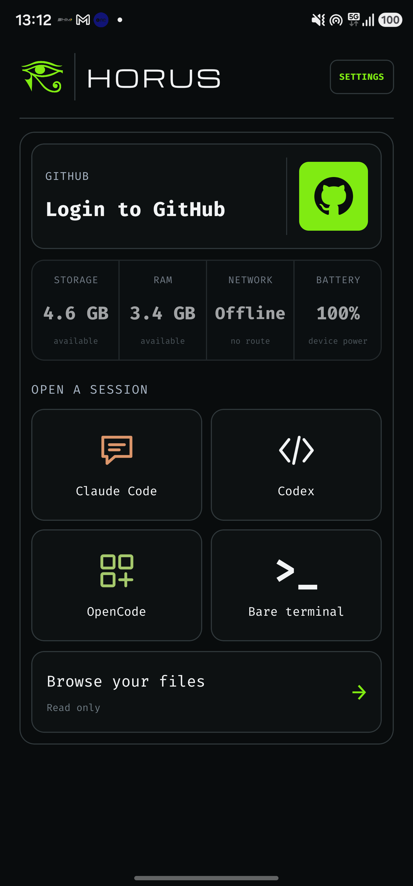
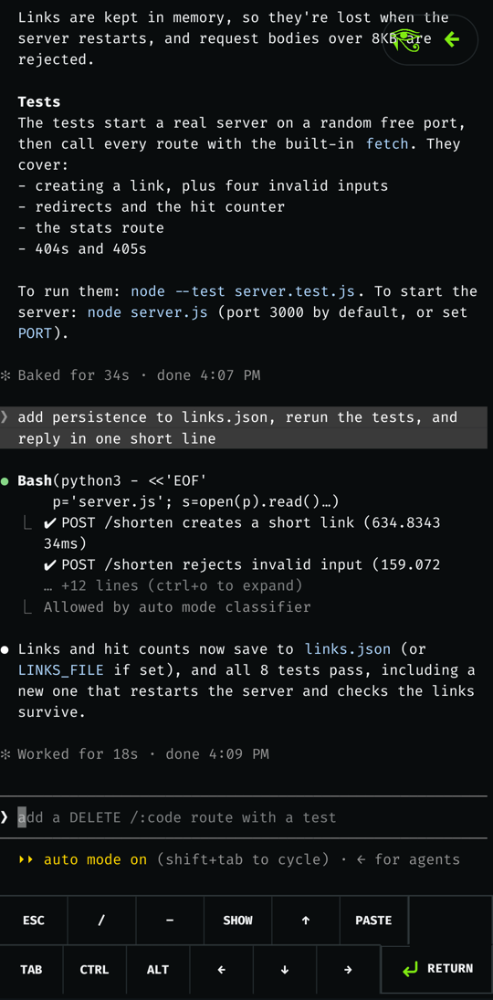
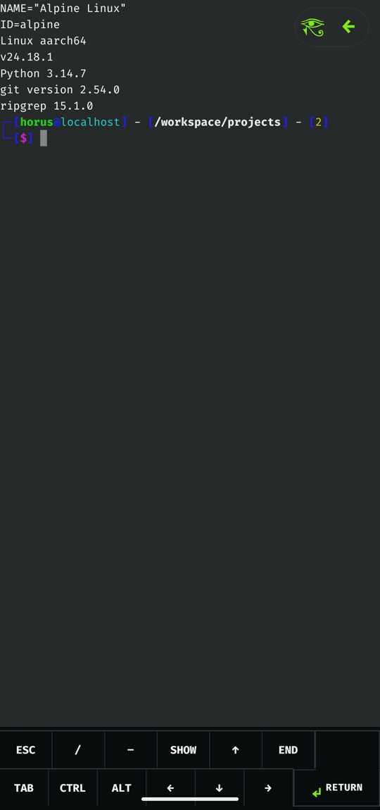

# Horus

Horus puts a real Alpine Linux ARM64 workspace on an Android phone and runs
coding agents in it: **Claude Code**, **Codex**, and **OpenCode**, or a plain
zsh shell. No root and no Termux are required. The app ships its own PRoot
runtime, a native PTY, and a native terminal renderer.

Plug the phone into a computer and you can also use it like a small cloud VM:
SSH in, forward ports, and sync files over USB with the optional
[`horus` CLI](cli/README.md).

**[Website](https://scariflabs.com/horus)** ·
**[Documentation](https://scariflabs.com/horus/docs)** ·
**[F-Droid (in review)](https://gitlab.com/fdroid/fdroiddata/-/merge_requests/50351)** ·
**[horus-cli on npm](https://www.npmjs.com/package/horus-cli)** ·
**[Issues](https://github.com/scarif-labs/horus/issues)**

<p align="center">
  
  
  
</p>

## Get Horus

- **F-Droid:** the submission is
  [in review](https://gitlab.com/fdroid/fdroiddata/-/merge_requests/50351).
- **From source:** see [Build from source](#build-from-source).

You need an ARM64 (`arm64-v8a`) phone running Android 7.0 (API 24) or newer.
New to Horus? Start with the
[beginner's guide](https://scariflabs.com/horus/docs).

## For F-Droid maintainers

Everything needed to find, build, and verify the app is listed here. The
build recipe (`metadata/com.scariflabs.horus.yml`) is in
[fdroiddata!50351](https://gitlab.com/fdroid/fdroiddata/-/merge_requests/50351).

| | |
| :-- | :-- |
| Package ID | `com.scariflabs.horus` |
| License | [MIT](LICENSE); bundled components in [THIRD_PARTY_NOTICES.md](THIRD_PARTY_NOTICES.md) |
| Source | <https://github.com/scarif-labs/horus> |
| Issue tracker | <https://github.com/scarif-labs/horus/issues> |
| Releases | Git tags `vX.Y.Z`; `versionName` and `versionCode` are in [`android/app/build.gradle`](android/app/build.gradle) |
| Store metadata | [`fastlane/metadata/android/en-US/`](fastlane/metadata/android/en-US/) (description, screenshots, changelogs by `versionCode`) |
| ABI | `arm64-v8a` only |
| Min / target SDK | 24 / 36 |

### Anti-features

- **NonFreeNet.** Horus downloads Alpine Linux, its packages, and the coding
  agents from their upstream servers. Claude Code and Codex need accounts with
  their providers.
- **NonFreeAdd.** Horus offers to install Claude Code and Codex, which are
  proprietary. OpenCode and the plain shell are free software. Horus never
  handles provider credentials; sign-in happens inside each CLI.

### What is built from source

- **PRoot, talloc, and libandroid-shmem** are compiled during the Gradle build
  by [`scripts/native/build-proot-runtime.sh`](scripts/native/build-proot-runtime.sh):
  - `native/proot`: submodule, [termux/proot](https://github.com/termux/proot) v5.1.107.92, GPL-2.0;
  - `native/libandroid-shmem`: submodule, [termux/libandroid-shmem](https://github.com/termux/libandroid-shmem) v0.7, BSD-3-Clause;
  - `native/talloc`: talloc 2.4.3 core sources, vendored, LGPL-3.0-or-later.

  Horus's own changes are in [`native/patches/`](native/patches/). The build
  writes a runtime manifest with each binary's SHA-256, and the app refuses to
  start PRoot if the installed binaries don't match it.
- **The PTY** is [`android/app/src/main/cpp/terminal_pty.c`](android/app/src/main/cpp/terminal_pty.c)
  (JNI).
- **Hermes bytecode compiler.** Gradle uses `node_modules/hermes-compiler`'s
  bundled `hermesc` by default. Set `horus.hermesCommand` (see
  [`android/app/build.gradle`](android/app/build.gradle)) to use one built from
  source instead. The F-Droid recipe builds `hermesc` from the Hermes srclib
  and deletes the prebuilt one.

No binaries are committed except `android/gradle/wrapper/gradle-wrapper.jar`.

### Network, tracking, and permissions

- No analytics, crash reporting, ads, or Google Play Services. The diagnostic
  log stays on the device and records lifecycle metadata only, never terminal
  input or output.
- **Downloads at runtime:** a pinned Alpine minirootfs from
  `dl-cdn.alpinelinux.org`, checked against a SHA-256 in
  [`AlpineRootfsCatalog.kt`](android/app/src/main/java/com/scariflabs/horus/terminal/AlpineRootfsCatalog.kt).
  After that it downloads Alpine packages, and each agent from its publisher
  the first time it is opened.
- **Permissions:**

  | Permission | Why |
  | :-- | :-- |
  | `INTERNET`, `ACCESS_NETWORK_STATE` | Download Alpine, packages, and agents; show network state on the home screen |
  | `FOREGROUND_SERVICE`, `FOREGROUND_SERVICE_SPECIAL_USE` | Keep terminal sessions running in a separate `:terminal` process while the UI is closed |
  | `POST_NOTIFICATIONS` | One notification per running session, and "waiting for you" when an agent finishes a turn |
  | `WAKE_LOCK` | Keep the CPU awake while a session is running |
  | `REQUEST_IGNORE_BATTERY_OPTIMIZATIONS` | Asked for during setup so Android doesn't pause long agent runs |
  | `VIBRATE` | Short haptic feedback on button taps |
  | `WRITE_EXTERNAL_STORAGE` (API ≤ 28 only) | Copy a folder to `Download/Horus` on old Android versions |

## Features

- **Alpine workspace on first launch.** Horus downloads a pinned Alpine
  minirootfs, checks its SHA-256 digest, and extracts it into app-private
  storage. Base tools such as `git`, `curl`, `jq`, `rg`, `python3`, and Node
  are provisioned on demand.
- **Coding agents in one tap.** Each agent is installed into its own home
  directory the first time you open it, with the installer output visible in
  the terminal. Later launches reuse the install.
- **Projects.** Create a local folder, clone any HTTPS/SSH Git URL, or pick one
  of your GitHub repositories. The GitHub CLI's device login opens in the
  Android browser. Projects live under `/workspace/projects`.
- **Real terminal.** The native PTY supports resize, Ctrl‑C, and job control.
  An extra key bar provides Esc, Tab, arrows, and sticky Ctrl/Alt.
- **Sessions survive the UI.** PTYs run in a foreground service in a separate
  `:terminal` process, so they keep running when you switch apps, when the app
  locks, or when Android reclaims the UI.
- **Local lock.** A password protects the app, and only a salted
  PBKDF2-HMAC-SHA256 verifier is stored. The workspace locks after 15 minutes
  in the background.
- **Read-only file browser** for your home directory and `/workspace`, with
  text previews and a copy-to-Downloads action.
- **Optional remote access over USB** with the [`horus` CLI](cli/README.md):
  SSH, `scp`/`rsync`, port forwarding, and commands across several phones. It
  is off by default and nothing else depends on it.

The [documentation](https://scariflabs.com/horus/docs) walks through each of
these step by step.

## Build from source

Requirements: Node.js ≥ 22.11, JDK 17, and the Android SDK and NDK (the
standard [React Native environment](https://reactnative.dev/docs/set-up-your-environment)).
The native runtime also needs `make`, `bash`, and `git`.

```sh
git clone --recurse-submodules https://github.com/scarif-labs/horus.git
cd horus
npm ci
npm run build:android:debug      # or build:android:release
adb install -r android/app/build/outputs/apk/debug/app-debug.apk
```

If you cloned without `--recurse-submodules`, run
`git submodule update --init` for the PRoot and libandroid-shmem sources.

Debug builds embed the JavaScript bundle, so they start without Metro. They
also skip the password screens and open straight into a development terminal.
Release builds enable the full onboarding and lock flow.

Release builds are unsigned unless you pass a keystore through Gradle
properties, for example in `~/.gradle/gradle.properties`:

```properties
horus.releaseStoreFile=/path/to/release.keystore
horus.releaseStorePassword=...
horus.releaseKeyAlias=...
horus.releaseKeyPassword=...
```

## Tests

```sh
npm run typecheck
npm run lint
npm run test:unit                # Jest (TypeScript / React Native)
npm run test:kotlin              # JVM unit tests for the native layer
npm run test:android:connected   # instrumented tests on a connected device
```

## Remote access (optional)

Horus works entirely on the phone. To also use it from a Mac or Linux
computer, install the CLI, turn on USB debugging on the phone, and pair:

```sh
npm install -g horus-cli
horus pair
horus ssh
```

[cli/README.md](cli/README.md) lists every command, and the
[CLI guide](https://scariflabs.com/horus/docs/cli) covers setup from scratch.

How it's secured:

- The phone runs `dropbear` inside Alpine, bound to its loopback only
  (`127.0.0.1:8022`). Computers reach it through `adb forward`; nothing
  listens on Wi-Fi.
- Logins are key-only and only as the profile user; root is refused.
  `horus pair` sends the computer's key through `adb shell content call`. The
  app accepts that call only from the adb shell, and it needs the Horus
  password, which shares the lock screen's attempt limit.
- The SSH server has its own notification with a **Turn off** action.
  **Settings → Remote access** turns it off and lists paired computers, which
  you can revoke.

## How it works

```
React Native UI (App.tsx, src/)
  │  TerminalRuntime TurboModule + TerminalCanvas / TerminalInput native views
  ▼
Kotlin native layer (android/app/src/main/java/com/scariflabs/horus/terminal)
  ├─ DistroStore*          rootfs download → verify → extract → promote
  ├─ ProotSessionLauncher  builds the PRoot command line and guest environment
  ├─ TerminalSessionService  foreground service in the :terminal process
  └─ NativeTerminalEngine / TerminalCanvasView  VT parsing and rendering
        │
        ▼
terminal_pty.c (JNI) ── PRoot (native/, built from source) ── Alpine rootfs
```

Each agent runs as its own locked guest user (UIDs 61001–61003) with a private
home. All of them share workspace GID 1000, so they can work on the same
projects.

## Security notes

- Android's app sandbox is the only real security boundary. PRoot emulates
  user IDs but gives no kernel isolation between agent users. Don't run code
  you don't trust.
- Codex's own Linux sandbox doesn't work under PRoot, so the shell wraps
  `codex` with `--sandbox danger-full-access`. Codex's approval prompts still
  apply.
- Remote access is off until you pair a computer or turn it on. When on, it
  listens on the phone's loopback only, accepts only paired keys, and refuses
  root. Any app on the phone can reach loopback ports, so the key is the
  boundary.

## License

[MIT](LICENSE). Bundled third-party components (xterm.js, PRoot, talloc,
libandroid-shmem, fonts, agent marks) are listed with their licenses in
[THIRD_PARTY_NOTICES.md](THIRD_PARTY_NOTICES.md).
