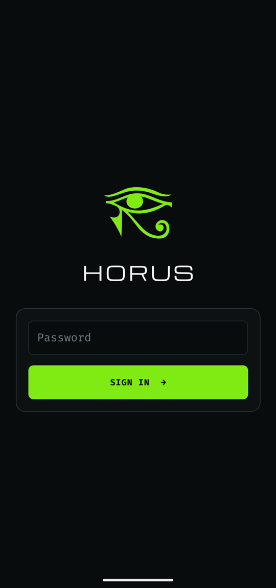
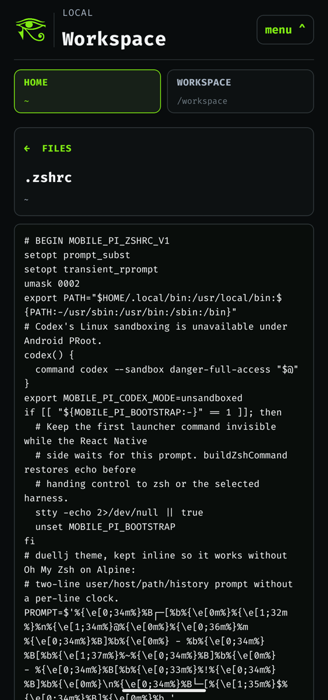
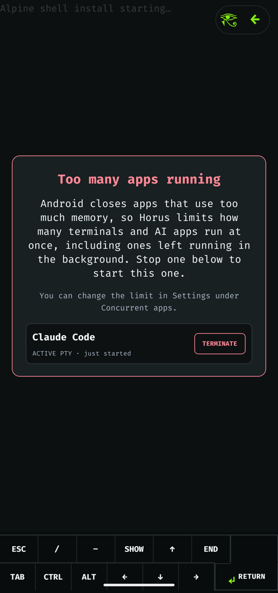

# Horus

Horus puts a real Alpine Linux ARM64 workspace on an Android phone and lets you
run coding agents — **Claude Code**, **Codex**, and **OpenCode** — or a plain
zsh shell inside it. No root and no Termux are required. The app ships its own
PRoot runtime, a native PTY, and a native terminal renderer.

<p align="center">
  
  
  
</p>

## Features

- **Alpine workspace on first launch.** Horus downloads a pinned Alpine
  minirootfs, checks its SHA-256 digest, and extracts it into app-private
  storage. Base tools such as `git`, `curl`, `jq`, `rg`, `python3`, and Node
  are provisioned on demand.
- **Coding agents in one tap.** Each harness is installed into its own home
  directory the first time you open it. Installer output stays visible in the
  terminal, and later launches reuse the install. Sign-in happens inside each
  CLI; Horus never handles provider credentials.
- **Projects.** You can create a local folder, clone any HTTPS/SSH Git URL, or
  pick one of your GitHub repositories. The GitHub CLI's device login opens in
  the Android browser. Projects live under `/workspace/projects`.
- **Real terminal.** The native PTY supports resize, Ctrl‑C, and job control.
  Output is rendered with an xterm.js engine. An extra key bar provides Esc,
  Tab, arrows, and sticky Ctrl/Alt.
- **Sessions survive the UI.** PTYs run in a foreground service in a separate
  `:terminal` process. They keep running when you switch apps, when the app
  locks, or when Android reclaims the UI. Each running session has its own
  notification.
- **Local lock.** Setting a password protects the app. Only a salted
  PBKDF2-HMAC-SHA256 verifier is stored. The workspace locks after 15 minutes
  in the background.
- **Read-only file browser** for your home directory and `/workspace`, with
  text previews.
- **Optional remote access over USB.** Pair a computer with the `horus` CLI to
  get an SSH shell on the phone, copy and sync files, forward ports, and run
  commands on several phones at once. It is off by default and nothing else
  depends on it (see [Remote access](#remote-access-optional)).

## Screenshots

| Sign in | Launcher | Active sessions |
| :-: | :-: | :-: |
|  |  |  |

| Choose a project | Claude Code | Alpine shell |
| :-: | :-: | :-: |
|  |  |  |

| File browser | File preview | Session limit |
| :-: | :-: | :-: |
|  |  |  |

| Settings |
| :-: |
|  |

## Requirements

- An ARM64 (`arm64-v8a`) Android device. The minimum API level is 24; builds
  target API 36.
- Node.js ≥ 22.11, JDK 17, and the Android SDK/NDK. These are the standard
  [React Native environment](https://reactnative.dev/docs/set-up-your-environment)
  requirements. The native runtime also needs `make`, `bash`, and `git`.

## Build and run

```sh
git submodule update --init      # PRoot and libandroid-shmem sources
npm ci
npm run build:android:debug      # or build:android:release
adb install -r android/app/build/outputs/apk/debug/app-debug.apk
```

Debug builds embed the JavaScript bundle, so they start without Metro. They
also skip the password screens and open straight into a development terminal.
Release builds enable the full onboarding and lock flow.

Release builds are unsigned unless you pass a keystore through Gradle
properties, for example in `~/.gradle/gradle.properties`:

```properties
horus.releaseStoreFile=/path/to/release.keystore
horus.releaseStorePassword=...
horus.releaseKeyAlias=...
horus.releaseKeyPassword=...
```

## Tests

```sh
npm run typecheck
npm run lint
npm run test:unit                # Jest (TypeScript / React Native)
npm run test:kotlin              # JVM unit tests for the native layer
npm run test:android:connected   # instrumented tests on a connected device
```

The `scripts/alpine-poc/` directory holds host and device acceptance scripts
(`npm run test:alpine-p*`, `npm run test:android:alpine-p*`). The device
scripts need `adb` and an installed release APK.

## Remote access (optional)

Horus works entirely on the phone. If you also want to use it from a computer,
like a small cloud VM, the [`horus` CLI](cli/README.md) gives you an SSH shell
on the phone over USB. You can connect several phones at once.

### Install the CLI

You need Node 18+, `adb` (Android platform-tools), and OpenSSH (`ssh`, `scp`;
`rsync` for `horus sync`).

```sh
npm install -g horus-cli
horus help
```

The CLI has no dependencies. To run it from a clone of this repo instead,
use `npm install -g ./cli`.

### Connect a phone

1. On the phone, install Horus, finish setup, and turn on **USB debugging** in
   Android's developer options.
2. Plug the phone in and allow this computer when Android asks.
3. Run `horus pair` and enter the phone's Horus password. The first time, the
   phone installs its SSH server, which takes a minute and needs internet.

### Use it

```sh
horus devices               # connected phones and their state
horus ssh                   # zsh on the phone
horus exec --all -- uname -a
horus cp -r ./app pixel:/workspace/projects/
horus sync ./site/ pixel:/workspace/site/ --delete
horus forward 3000          # phone's port 3000 at localhost:3000
horus config --install      # plain `ssh pixel`, VS Code Remote-SSH
horus stop                  # turn remote access off on the phone
```

- `claude`, `codex` and `opencode` install into `~/.local` on the phone the
  first time you run them over SSH, the same way the app's tiles install them.
- `horus cp` copies like `scp` and follows symlinks; `horus sync` keeps them.
- Android 12+ may kill busy background processes. `horus tune` lifts that
  limit once for the whole phone.

See [cli/README.md](cli/README.md) for every command.

### How remote access is secured

- The phone runs `dropbear` inside Alpine, bound to its loopback only
  (`127.0.0.1:8022`); computers reach it through `adb forward`. Nothing listens
  on Wi-Fi.
- Logins are key-only and only as the profile user. `horus pair` sends this
  computer's key through `adb shell content call`. The app accepts that call
  only from the adb shell, and it needs the Horus password, which shares the
  login's attempt limit.
- The SSH server runs in the terminal service, with its own notification and a
  Turn off action, and comes back after Android restarts the service.
  **Settings → Remote access** turns it off and lists paired computers, which
  you can revoke.

## How it works

```
React Native UI (App.tsx, src/)
  │  TerminalRuntime TurboModule + TerminalCanvas / TerminalInput native views
  ▼
Kotlin native layer (android/app/src/main/java/com/scariflabs/horus/terminal)
  ├─ DistroStore*          rootfs download → verify → extract → promote
  ├─ ProotSessionLauncher  builds the PRoot command line and guest environment
  ├─ TerminalSessionService  foreground service in the :terminal process
  └─ NativeTerminalEngine / TerminalCanvasView  VT parsing and rendering
        │
        ▼
terminal_pty.c (JNI) ── PRoot (native/, built from source) ── Alpine rootfs
```

- PRoot, talloc, and libandroid-shmem are compiled from the pinned sources in
  `native/` by `scripts/native/build-proot-runtime.sh` during the Gradle build,
  with the patches in `native/patches/`. No prebuilt binaries are committed.
  The build generates the runtime manifest with each binary's SHA-256, and the
  app refuses to start PRoot if the installed binaries don't match.
- Each harness runs as its own locked guest user (UIDs 61001–61003) with a
  private home. All harness users share workspace GID 1000, so they can work
  on the same projects.

### Security notes

- Android's app sandbox is the only real security boundary. PRoot emulates
  user IDs but gives no kernel isolation between harness users. Don't run
  harness code you don't trust.
- Codex's own Linux sandbox doesn't work under PRoot, so the shell wraps
  `codex` with `--sandbox danger-full-access`. Codex's approval prompts still
  apply.
- The diagnostic log records lifecycle metadata only, never terminal input or
  output.
- Remote access is off until you pair a computer or turn it on. When on, it
  listens on the phone's loopback only, accepts only paired keys, and refuses
  root. Any app on the phone can reach loopback ports, so the key is the
  boundary.

## License

[MIT](LICENSE). Bundled third-party components (xterm.js, PRoot, talloc,
libandroid-shmem, fonts, harness marks) are listed in
[THIRD_PARTY_NOTICES.md](THIRD_PARTY_NOTICES.md).
